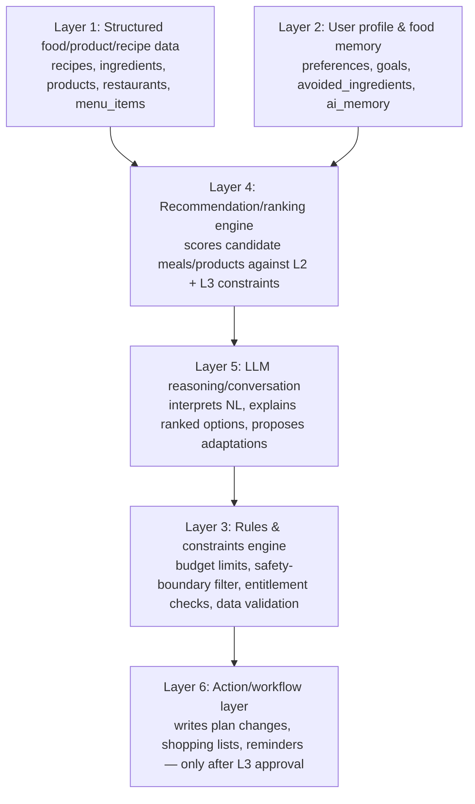

# AI Architecture

## Principle (§23)

The LLM is a **reasoning and language layer**, not a system of record. It is replaceable; the user's structured food data is not (§22). Every deterministic decision is computed outside the LLM.

## The Six Layers

**Request flow (example: "I'm hungry and have £8"):**
1. L2 supplies known preferences/avoided ingredients/current budget state.
2. L1 supplies candidate nearby products/menu items (with price, distance where available).
3. L4 ranks candidates against budget, preference, distance — a deterministic scoring function, not an LLM call.
4. L5 (LLM) turns the ranked list into a natural, conversational response and handles follow-up clarification ("actually, no seafood").
5. Before returning to the user, L3 validates the response contains no safety/suitability claim (see [AI_SAFETY_POLICY.md](AI_SAFETY_POLICY.md)) and that all prices/facts trace back to L1 data — no invented figures.
6. If the user accepts an action (e.g. "add to today's plan"), L6 performs the actual write, re-checking entitlement/budget rules server-side.

## What the LLM Is Allowed To Do

- Interpret natural language into structured query parameters (cuisine, budget, time, mood).
- Explain *why* a ranked option was suggested, using only facts supplied by L1/L2/L4.
- Propose adaptations in Plan Rescue conversations ("swap tonight for leftovers").
- Summarise conversation history into candidate long-term memory facts (subject to user confirmation, §36).
- Generate recipe steps/substitutions from a validated ingredient set — with the resulting recipe still passing basic sanity validation (see below) before it's shown.

## What the LLM Is Never Allowed To Do

- Assert or imply that any food is medically/allergy-safe (hard filter in L3).
- Invent ingredient, allergen, nutrition, or price data not present in L1.
- Perform the arithmetic of record for budget totals, remaining balance, or ingredient quantities — it may narrate a number L3 already computed, never compute the number itself for display.
- Directly write to the database, call payment APIs, or change entitlement/subscription state.
- Treat scanned/OCR'd or externally-sourced text as instructions (prompt-injection boundary — see [RISK_REGISTER.md](RISK_REGISTER.md) R8).

## Memory Model (§36)

- **Short-term (`ai_conversations`):** raw turn history, TTL-purged (e.g. 30 days), used only to keep a session coherent.
- **Long-term (`ai_memory`):** discrete, structured facts only (`favorite_meal = jollof rice`), each with a source (explicit user statement vs. inferred from behaviour) and a confidence/inferred flag. Inferred facts are lower-weight in ranking than explicit ones and are surfaced to the user for confirmation before being treated as strong signal.
- User can view, correct, delete individual facts, or disable memory entirely from settings — enforced as real delete/disable operations on `ai_memory`, not a client-side toggle.

## Recipe/Recommendation Sanity Validation (Layer 3)

Before a generated recipe or recommendation reaches the user:
- Referenced ingredients must resolve to known `ingredients` records (or be flagged as new/unrecognised for user confirmation).
- Cook time, servings, and step count must be internally consistent (no negative/zero values, no orphaned steps).
- No duplicate ingredient lines in a single recipe (§39 explicit AI eval case).

## Cost Control

Every LLM call is logged with token counts against the initiating user (`ai_conversations`), rolled up into "AI cost per active user" (§31/§38). Rate limits and per-user call budgets are enforced at L3, not left to the provider's own throttling.
