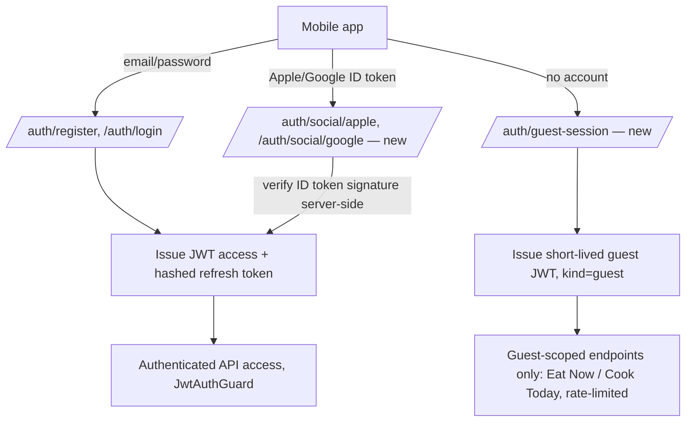

# FoodPadi Authentication Specification

Implements the authentication decisions in [FOODPADI_LOGIN_ONBOARDING_RESEARCH.md](FOODPADI_LOGIN_ONBOARDING_RESEARCH.md) §10. Describes changes as diffs against the existing `apps/api` implementation, not a redesign.

## Current State (already implemented)

- `apps/api/src/modules/auth/auth.service.ts`: email/password registration and login, bcrypt hashing (12 rounds), JWT access tokens (default 15m) + hashed, revocable refresh tokens (default 30d) stored in `refresh_tokens`.
- Password reset: single-use, 1-hour-expiry tokens in `password_reset_tokens`, resets revoke all existing refresh tokens. Dev-only `MailerService` logs instead of emailing (no provider wired up — see `apps/api/README.md`).
- `User.authProvider` field already exists in the Prisma schema (`"password" | "apple" | "google"`), unused beyond the `"password"` default today — the schema already anticipated social login.
- No guest/anonymous session concept exists.
- No rate limiting exists on any endpoint today.

## Target Authentication Methods

| Method | Priority | Notes |
|---|---|---|
| Email/password | Kept as-is | Already correct: bcrypt, JWT, revocable refresh tokens. |
| Apple Sign-In | P1 | Ship together with Google (Apple App Store guideline requirement when a third-party social login is offered). |
| Google Sign-In | P1 | Ship together with Apple. |
| Guest session | P0/P1 | New — lightweight, not a "login method" for a persistent identity; see below. |
| Passkeys (WebAuthn) | P2/P3 | Credible 2026 adoption data, not required for MVP; revisit once Apple/Google sign-in and guest sessions are stable. |
| Magic link | Not planned | Documented deliverability failure modes; would need a fallback method to be viable at all, which defeats its own simplicity argument. |

### Apple/Google Sign-In implementation notes

- Both use the existing `User.authProvider` field and `User.passwordHash` becoming nullable-and-unused for social accounts (already nullable in the schema — `passwordHash String?`).
- New: `User` needs a way to store the provider's stable subject identifier (`sub` claim) to look up returning social-login users without relying on email match alone (email can change or be a private relay address on Apple). Add `providerSubject String?` (unique per `authProvider`) — see Database Changes.
- Server verifies the Apple/Google ID token signature server-side (never trusts a client-asserted identity) before issuing FoodPadi's own JWT access/refresh tokens — the rest of the session model (JWT access + hashed refresh token) is unchanged and reused as-is.
- Account linking rule: if a social sign-in's verified email matches an existing password-based account, prompt the user to confirm linking rather than silently merging (avoids account-takeover via a spoofed/pre-registered email at a provider that doesn't verify email ownership as strictly).

### Guest session design

A guest session is **not** a `User` row. It is a short-lived, signed, opaque session identifier, minted server-side on first guest interaction, used only to:
1. Rate-limit AI calls per guest (stricter than authenticated limits — see Security Requirements).
2. Log disclaimer acknowledgement for the safety boundary (§ onboarding spec).
3. Correlate a single guest's requests for basic abuse detection.

It is explicitly **not** used to persist preferences, memory, pantry state, or plans — those all require a real account by design (§9 of the research doc). This keeps the guest-to-account transition simple: there is no guest data to migrate, because none is created.

Implementation: a signed token (same JWT infra already in place, `@nestjs/jwt`) with a short claim set (`{ kind: 'guest', sessionId, iat, exp }`), short expiry (e.g. 24h, renewable on use), issued by a new, unauthenticated `POST /auth/guest-session` endpoint. No database row is required for the guest session itself; disclaimer-acknowledgement-for-guests can be logged keyed by `sessionId` in a small table if audit trail is required (see Database Changes) or, more simply, encoded as a claim in the token itself once acknowledged (reissue the token with `disclaimerAcknowledged: true`) — recommend the claim approach to avoid a table for purely ephemeral state.

## Database Changes

```prisma
model User {
  // ...existing fields unchanged...
  providerSubject String? @map("provider_subject") // Apple/Google `sub` claim

  @@unique([authProvider, providerSubject])
}
```

No new tables are required for the guest session itself (token-encoded state, per above). If product direction later requires a durable audit log of guest disclaimer acknowledgements independent of token lifetime, add:

```prisma
model GuestSessionEvent {
  id                String   @id @default(uuid())
  sessionId         String   @map("session_id")
  disclaimerShownAt DateTime @map("disclaimer_shown_at")
  createdAt         DateTime @default(now()) @map("created_at")

  @@map("guest_session_events")
}
```
Not part of the P0/P1 build — only add if the claim-based approach proves insufficient for audit needs.

## Authentication Architecture (updated)



`JwtAuthGuard` (existing, `apps/api/src/modules/auth/jwt-auth.guard.ts`) continues to gate all `/users/me/*` and persistence routes unchanged. A new, separate guard (`GuestOrAuthGuard`) is needed for the Eat Now/Cook Today endpoints once built (Phase 2/4), accepting either a real access token or a valid guest token, and exposing which one it got to the controller so rate limits can differ.

## Security Requirements

- **Never trust a client-asserted social identity** — Apple/Google ID tokens are verified server-side against the provider's public keys before any `User` row is created or matched.
- **Guest tokens are scoped and short-lived** — they must never grant access to `/users/me/*`, `/users/me/export`, or any write to `ai_memory`, `pantry_items`, `meal_plans`, `shopping_lists`, or `avoided_ingredients`. Enforce this as an explicit allowlist in `GuestOrAuthGuard`, not by omission.
- **Rate limiting** (does not exist today — genuine gap, not specific to guests): add per-identity request limits on `/auth/*` (already sensitive — brute force/credential stuffing) and on any AI-calling endpoint, with guest limits set stricter than authenticated-user limits. This closes a real current gap flagged in [SECURITY_MODEL.md](SECURITY_MODEL.md) ("Rate limiting per user/IP on auth endpoints... also serves cost control") that has not yet been implemented.
- **Account linking confirmation** — see above; never silently merge a social login into an existing password account without explicit user confirmation.
- **Apple Sign-In private relay emails** — must be handled as a valid, permanent email address (don't assume `@privaterelay.appleid.com` addresses are invalid or require special-casing beyond normal validation).
- Existing controls (bcrypt, hashed+revocable refresh tokens, disclaimer/safety boundary, entitlement checks server-side) are unchanged and already correctly designed per [SECURITY_MODEL.md](SECURITY_MODEL.md) — this spec adds to that model, it doesn't replace any of it.

## Minimum Authentication Set for MVP

Per the research recommendation (avoid adding methods merely because competitors have them): **email/password (kept) + Apple Sign-In + Google Sign-In (shipped together) + guest session**. Magic link and passkeys are explicitly deferred, not omitted by oversight.
