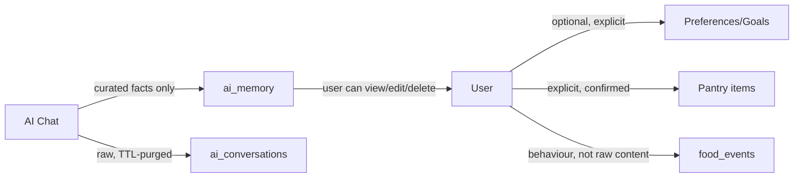

# Privacy & Data Model (UK GDPR)

This document is a design-time privacy analysis, not a substitute for formal legal review. **Legal/DPO sign-off is required before production launch**, especially regarding special-category data handling (see below).

## Principles Applied

- **Data minimisation:** onboarding requires only authentication + one goal selection (§10). Everything else — cuisine preferences, budget, household size, avoided ingredients — is optional and requested only when it improves a feature the user is actively using.
- **Purpose limitation:** location data is used only for the Eat Now request that requested it, never repurposed for advertising or unrelated profiling.
- **Transparency:** disclaimer (§12) and a plain-language privacy notice are shown at onboarding and always available in Settings.
- **Retention:** short-term AI conversation history (`ai_conversations`) is TTL-purged (proposed: 30 days); long-term memory (`ai_memory`) persists only as discrete user-visible facts the user can inspect/delete at will.
- **User rights:** access (view profile/memory in-app), correction (edit any preference/memory fact), erasure (delete individual facts or the whole account), portability (structured export, e.g. JSON).

## Special-Category Data Risk

The product **never asks** for health/medical information — UI language is deliberately "foods/ingredients I choose to avoid," not "my medical conditions" (§11, Decision 12). However, users may **voluntarily** disclose health-adjacent information in free-text fields or chat (e.g. "I avoid dairy because of my condition").

Treatment:
- Any free-text field capable of carrying such disclosure (`avoided_ingredients.note`, chat messages, `user_feedback.message`) is treated as **potentially special-category data**: encrypted at rest, excluded from default analytics/BI exports, and not used to train or fine-tune any model without separate, explicit consent and legal review.
- The system does not attempt to infer, tag, or classify medical conditions from this text (§9: "must not infer sensitive medical information unnecessarily").
- A DPIA (Data Protection Impact Assessment) is recommended before launch given this exposure, even though it's incidental rather than by-design (§26).

## Location Data

- Optional, permission-gated, foreground-only in MVP (no continuous background tracking, §28).
- Used transiently for a single Eat Now request; not retained as a location history beyond what's needed for that session's results (a coarse "last known area" may be cached briefly to avoid re-prompting, with a clear expiry).

## Data Flow Summary

## Consent & Legal Basis (design intent, subject to legal confirmation)

- Account/service data: contract necessity (providing the service the user signed up for).
- Optional preference/memory data: consent, revocable at any time via delete.
- Marketing communications (if any, post-MVP): separate opt-in, not bundled with service notifications.

## Explicit Non-Goals

- No medical/diagnostic data collection by design (Decision 11).
- No selling or third-party sharing of personal food data beyond what's operationally necessary (e.g. a payment processor, a push notification provider) — data processing agreements required with any such processor.
