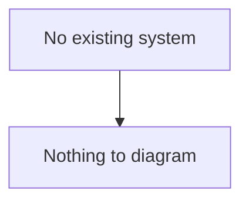
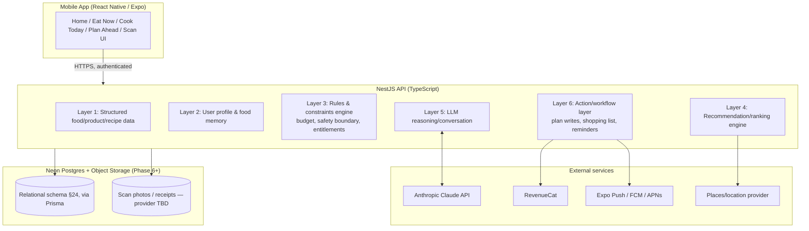

# Technical Architecture

## 1. Current-State Architecture

None. Greenfield project (see [PRODUCT_DISCOVERY.md](PRODUCT_DISCOVERY.md)).

## 2. Stack Decision

Multiple valid stacks exist. This is the recommendation and the reasoning, so future contributors don't relitigate it without cause.

### 2.1 Mobile client — React Native (Expo, TypeScript)

**Recommended over:** Flutter, native Swift/Kotlin twin codebases.

Why:
- Single TypeScript codebase for iOS + Android, shared types with the backend — important given how much of this product is data-shape-driven (meal plans, pantry items, budgets) rather than graphics-heavy.
- Expo gives production-grade modules for exactly the surfaces this product needs day one: camera (Scan), barcode scanning, push notifications, background fetch, secure storage — without ejecting.
- EAS Build/Submit + OTA updates matter for a companion product that will tune conversational/recommendation behaviour frequently; native-only twins double that release cost.
- Larger UK contractor/hire pool than Flutter, lower long-term bus-factor risk.

Trade-off accepted: marginally worse performance ceiling than fully native for very heavy animation — not a bottleneck for this product's UI (cards, chips, lists, camera).

### 2.2 Backend — Node.js + TypeScript (NestJS) as an API layer in front of Postgres

**Recommended over:** calling Supabase directly from the mobile client; a Python backend (Django/FastAPI).

Why:
- The spec is explicit (§23, §25) that the LLM and the client must **never** directly perform deterministic business logic (budget math, entitlement checks, quantity consolidation). That requires a real server-side layer that owns those rules — not just RLS policies callable from the client.
- NestJS's module/provider structure maps directly onto the six-layer AI architecture the spec mandates (see [AI_ARCHITECTURE.md](AI_ARCHITECTURE.md)) — each layer becomes a NestJS module with an enforced boundary, instead of logic scattered across client and edge functions.
- TypeScript end-to-end (client ↔ server ↔ DB via Prisma) removes an entire class of shape-mismatch bugs between mobile and API.
- Node has first-class SDKs for Anthropic Claude, Stripe/RevenueCat, and push notification providers, keeping the integration surface small.

### 2.3 Database — PostgreSQL on Neon, accessed only through the backend

**User decision:** Neon (serverless Postgres) is the database provider.

**Recommended over:** self-hosted Postgres + custom auth; a NoSQL primary store.

Why Postgres generally:
- The data model (§24) is inherently relational with many FKs (users → households → meal_plans → meal_plan_items → recipes → ingredients) — Postgres is the correct fit, not a document store.
- Neon gives managed, autoscaling Postgres with branching (a real database branch per PR/preview environment is genuinely useful for this project's migration-heavy early phases) and native Postgres row-level security, satisfying the "RLS where appropriate" and "encryption at rest" requirements in §25 without self-hosting.

Consequences of Neon vs. an all-in-one BaaS (e.g. Supabase):
- Neon provides Postgres only — no bundled Auth or Storage service. That's consistent with this architecture anyway: the NestJS API is the sole auth authority (its own JWT issuance, §2.7 below), not a third-party auth service, so nothing is lost there.
- **Object storage** (scan photos, receipts — Phase 6) needs a separate provider, since Neon doesn't provide one. Recommend Cloudflare R2 or AWS S3, decided when Phase 6 starts; not load-bearing now.
- **Important boundary unchanged:** the mobile app talks only to the NestJS API, never directly to the database. Business rules, entitlement checks, and writes to sensitive tables happen server-side. Postgres RLS is applied as defence-in-depth, not the primary authorization mechanism — this satisfies §25's "never trust the client."
- Prisma is the ORM/migration tool against Neon's connection string (`DATABASE_URL`); Neon's pooled connection string should be used for the API's runtime pool given serverless Postgres connection limits.

### 2.4 AI — Anthropic Claude (Messages API), called only from the backend

Why:
- The reasoning layer (Layer 5, §23) must never hold API keys or call the model directly from the client, and must never be the system of record for deterministic output. Backend-mediated calls let us: (a) keep keys server-side, (b) inject only the structured context the rules engine approves, (c) validate/clip output before it reaches the user (AI safety gate, see [AI_SAFETY_POLICY.md](AI_SAFETY_POLICY.md)), (d) swap models later without client changes — directly satisfying §22's "the AI should be replaceable."

### 2.5 Subscriptions — RevenueCat, fronted by our own entitlements table

Why:
- Abstracts iOS/App Store and Google Play billing behind one API, and supports **remote pricing/product configuration** (§20's explicit requirement not to hard-code prices) without an app release.
- Our backend still owns the source of truth for entitlement flags (feature gating, §27 of the phased plan) — RevenueCat webhooks update our `subscriptions` table; nothing in the app trusts client-reported purchase state.

### 2.6 Notifications — Expo Notifications (push) + backend-scheduled jobs

A scheduler (backend cron / queue) decides *when* and *why* to notify (§18, §37 — every notification must justify itself); Expo only handles delivery.

### 2.7 Infra / deployment

- Backend: containerized NestJS service, deployed to a managed container platform (e.g. Fly.io / Render / AWS ECS — final choice deferred to Phase 8, not load-bearing now).
- CI: lint + typecheck + test gate on every PR (§42).
- Observability: structured logging + error monitoring (Sentry) + basic AI cost/usage metering from day one, since §38/§31 require AI cost per active user as a tracked metric.

## 3. Target Architecture

## 4. Non-Negotiable Architectural Rules

1. Client never holds an LLM API key, a service-role DB key, or writes directly to tables governing entitlements, budgets, or safety copy.
2. Every deterministic calculation (budget totals, ingredient consolidation, quantities, subscription entitlement) is computed server-side and is unit-tested; the LLM may *describe* a result but never *produce* the number of record.
3. The allergy/medical safety boundary (§11) is enforced as a Layer 3 rule (a response filter + fixed disclaimer injection), not as an LLM instruction alone — LLM instructions are a second layer of defence, not the only one.
4. Pricing, feature flags, and entitlement thresholds live in server-side config, not client code or hard-coded constants.
